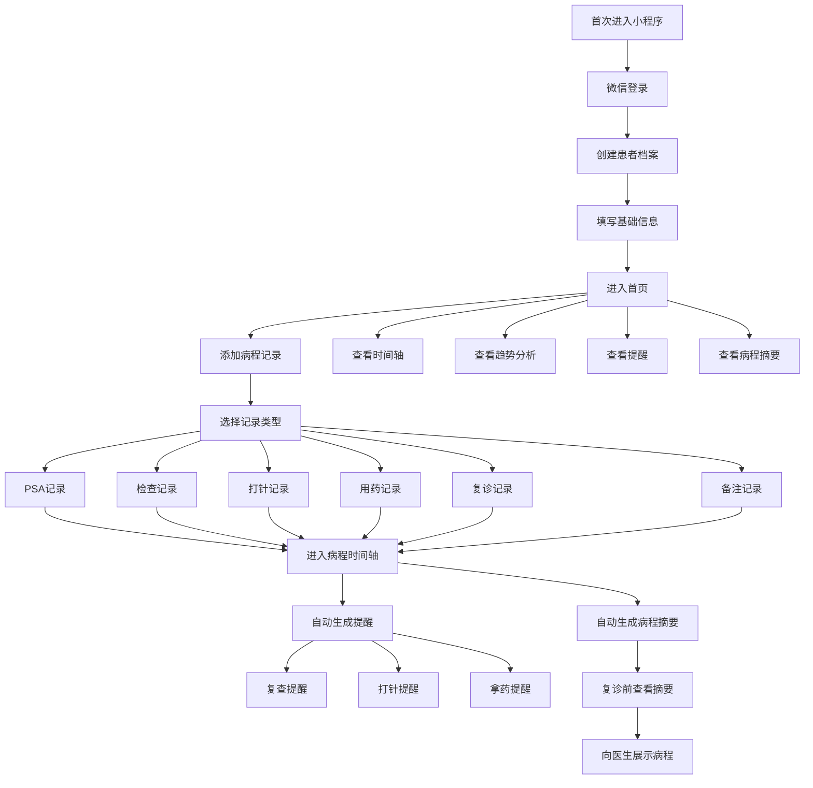
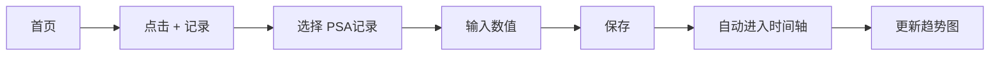
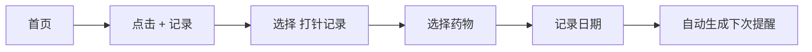
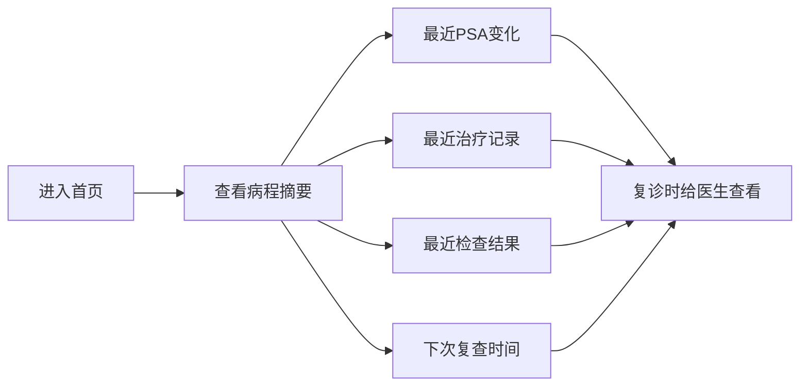

# 病程管家｜用户操作流程图 & 首页UI设计

# 一、产品核心用户路径

## 核心原则

整个产品围绕：

> 记录 → 管理 → 提醒 → 病程整理 → 复诊沟通

展开。

---

# 二、整体用户操作流程图



---

# 三、用户真实使用场景流程

## 场景1：记录PSA



---

## 场景2：记录打针



---

## 场景3：复诊前整理病情



---

# 四、产品核心页面结构

```text
┌────────────────────────────┐
│            首页             │
│      Home / Dashboard      │
└────────────┬───────────────┘
             │
 ┌───────────┼────────────┐
 │           │            │
时间轴     趋势分析      提醒
Timeline   Indicator   Reminder
 │           │            │
 └───────────┼────────────┘
             │
         病程摘要
          Summary
             │
          家庭协同
           Family
```

---

# 五、首页 UI 结构图（核心）

# 首页定位

首页不是个人中心。

而是：

# 「病程控制中心」

用户打开后：

* 立刻知道当前病情
* 立刻知道下一次治疗时间
* 立刻可以快速记录

---

# 六、首页 UI 草图（V1）

```text
┌──────────────────────────────┐
│ 病程管家                     │
│ 患者：父亲（前列腺癌）       │
├──────────────────────────────┤
│                              │
│ 当前状态                     │
│ ┌────────────────────────┐   │
│ │ 最近TPSA：4.1          │   │
│ │ 趋势：下降 ↓           │   │
│ │ 当前状态：治疗中       │   │
│ └────────────────────────┘   │
│                              │
├──────────────────────────────┤
│                              │
│ 即将到期提醒                 │
│ ┌────────────────────────┐   │
│ │ 下次PSA复查：8月15日   │   │
│ │ 下次打针：8月1日       │   │
│ │ 下次拿药：7月28日      │   │
│ └────────────────────────┘   │
│                              │
├──────────────────────────────┤
│                              │
│ 最近病程摘要                 │
│ ┌────────────────────────┐   │
│ │ PSA：8.2 → 4.1         │   │
│ │ 6月开始诺雷得治疗      │   │
│ │ MRI结果稳定            │   │
│ │ 医生建议继续观察       │   │
│ └────────────────────────┘   │
│                              │
├──────────────────────────────┤
│                              │
│ 快速功能                     │
│                              │
│  [时间轴] [趋势图]          │
│  [提醒]   [家庭协同]        │
│                              │
├──────────────────────────────┤
│                              │
│              ＋              │
│         快速添加记录         │
│                              │
└──────────────────────────────┘
```

---

# 七、首页核心模块说明

## 1. 当前状态模块

目标：

用户打开小程序后：

# 3秒内知道当前情况

展示内容：

* 最近PSA
* 当前趋势
* 当前治疗状态

---

## 2. 即将到期提醒模块

目标：

# 提高长期留存

展示：

* 下次复查
* 下次打针
* 下次拿药

这是用户长期打开产品的核心原因。

---

## 3. 病程摘要模块（重点）

目标：

# 自动帮助用户整理病情

而不是让用户自己翻时间轴。

展示：

* 最近指标变化
* 最近治疗变化
* 医生建议
* 最近检查

这是产品最核心价值之一。

---

## 4. 快速添加按钮（关键）

必须固定存在。

因为：

# 记录速度 = 产品生死线

点击后弹出：

```text
选择记录类型：

- PSA记录
- 检查记录
- 打针记录
- 用药记录
- 复诊记录
- 备注记录
```

---

# 八、时间轴页面 UI 草图

```text
┌──────────────────────────────┐
│ 病程时间轴                   │
├──────────────────────────────┤
│                              │
│ 2026-07-01                  │
│ ┌────────────────────────┐   │
│ │ MRI检查                │   │
│ │ 结果：稳定             │   │
│ └────────────────────────┘   │
│                              │
│ ┌────────────────────────┐   │
│ │ TPSA：4.1              │   │
│ │ 趋势下降               │   │
│ └────────────────────────┘   │
│                              │
│ 2026-06-01                  │
│ ┌────────────────────────┐   │
│ │ 注射诺雷得             │   │
│ │ 下次提醒：28天后       │   │
│ └────────────────────────┘   │
│                              │
│              ＋              │
│                              │
└──────────────────────────────┘
```

---

# 九、趋势分析页面 UI 草图

```text
┌──────────────────────────────┐
│ PSA趋势分析                  │
├──────────────────────────────┤
│                              │
│         折线趋势图           │
│                              │
│      8.2                     │
│       ●                      │
│        \                     │
│         \                    │
│          ● 4.1               │
│                              │
├──────────────────────────────┤
│                              │
│ 最近记录                     │
│                              │
│ 2026-07-01  TPSA：4.1       │
│ 2026-06-01  TPSA：6.2       │
│ 2026-05-01  TPSA：8.2       │
│                              │
└──────────────────────────────┘
```

---

# 十、提醒页面 UI 草图

```text
┌──────────────────────────────┐
│ 提醒中心                     │
├──────────────────────────────┤
│                              │
│ 🔔 7月28日 拿药提醒         │
│ 🔔 8月01日 打针提醒         │
│ 🔔 8月15日 PSA复查提醒      │
│                              │
├──────────────────────────────┤
│                              │
│ [添加提醒]                  │
│                              │
└──────────────────────────────┘
```

---

# 十一、家庭协同页面 UI 草图

```text
┌──────────────────────────────┐
│ 家庭协同                     │
├──────────────────────────────┤
│                              │
│ 当前成员                     │
│                              │
│ 👨 儿子（管理员）           │
│ 👩 女儿                     │
│ 👴 患者本人                 │
│                              │
├──────────────────────────────┤
│                              │
│ [邀请家人]                  │
│                              │
└──────────────────────────────┘
```

---

# 十二、产品核心设计原则

## 1. 所有记录必须足够快

目标：

# 10秒内完成记录

---

## 2. 时间轴是唯一核心

所有记录统一进入时间轴。

---

## 3. 首页是病程控制台

不是个人中心。

---

## 4. 病程摘要是核心价值层

真正帮助用户：

# 「整理病情」

而不是单纯记录。

---

# 十三、下一步开发建议

建议优先开发顺序：

1. 首页
2. 时间轴
3. 快速记录
4. 提醒系统
5. 趋势分析
6. 家庭协同
7. 病程摘要

先完成完整闭环，再逐步增强。
